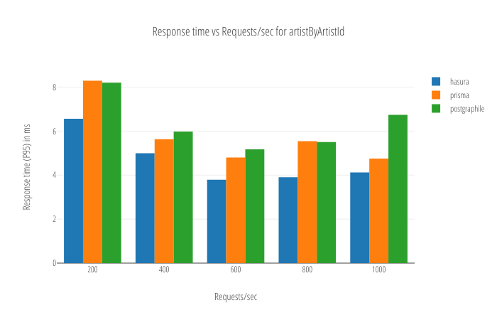

This repo maintains configuration to benchmark various GraphQL ORMs/backends ([hasura](https://hasura.io/graphql), [postgraphile](https://www.graphile.org/postgraphile), [prisma](https://prisma.io)). The database used is a [Postgres variant](https://github.com/xivSolutions/ChinookDb_Pg_Modified/tree/pg_names) of [Chinook](https://github.com/lerocha/chinook-database). The benchmarking tool used is [graphql-bench](https://github.com/hasura/graphql-bench).

## Running benchmarks

You'll need to have `docker` and `curl` to run these benchmarks

1. Clone the repo.
   ```bash
   git clone https://github.com/hasura/graphql-backend-benchmarks.git && cd graphql-backend-benchmarks
   ```

2. Setup the graphql servers that you are interested in.
   ```bash
   ./hasura/manage.sh init
   ./prisma/manage.sh mysql init
   ./postgraphile/manage.sh init
   ```

3. Define the queries that you would like to benchmark in `hasura/queries.graphql`, `prisma/queries.graphql`, `postgraphile/queries.graphql`. There are few queries that already exist.

4. Define a benchmark (checkout sample.bench.yaml) say bench.yaml.

5. Run the benchmark
   ```bash
   cat bench.yaml | docker run -i --rm -p 8050:8050 -v $(pwd):/graphql-bench/ws hasura/graphql-bench:0.3
   ```
   or run a benchmark on a sample query
   ```bash
   cat sample.bench.yaml | docker run -i --rm -p 8050:8050 -v $(pwd):/graphql-bench/ws hasura/graphql-bench:032 --query artistByArtistId
   ```
   This opens up a http server at http://127.0.0.1:8050 which displays the results of the benchmark.

6. Tear down the setup
   ```bash
   ./hasura/manage.sh nuke
   ./prisma/manage.sh mysql nuke
   ./postgraphile/manage.sh nuke
   ```

## Sample plot

When the above benchmark is run, the results on an i7-4710HQ CPU, 8GB RAM, SSD machine are as follows:

